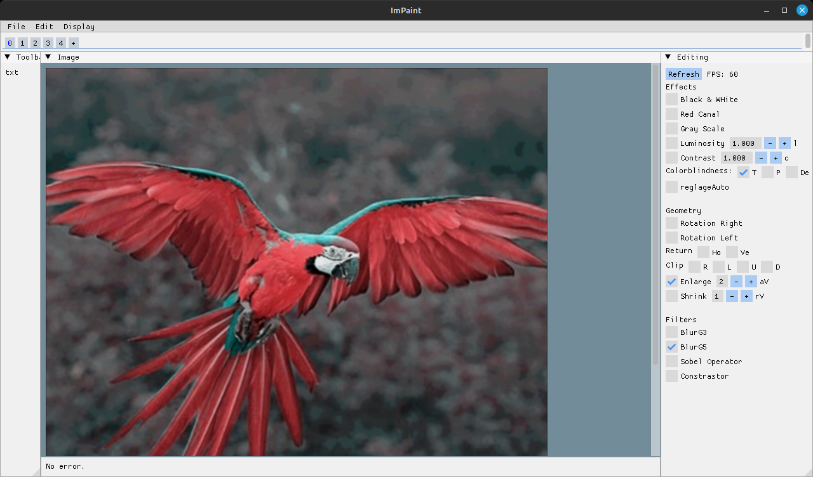

# ImPaint
[ImPaint](https://github.com/cursedastronaut/ImPaint) is a small program based on [imgui](https://github.com/ocornut/imgui) which allows simple picture editing.



## How to download
Simply head to the [releases](https://github.com/cursedastronaut/ImPaint/releases) to download the precompiled binaries.

## How to compile
You can use the Makefile, under `Windows`, or `Linux`:
```sh
mkdir objects #Where the objects are stored, run it only once
make -j
```

Run the compiled executable.

It needs **C++17**, **OpenGL**, and **GLFW3** library.
Specific platforms dependencies:
* **Windows**
  - Windows API required.

* **Linux**
  - Clip library required. (Included here, compiled on Ubuntu based distro).

## Thanks
Thanks to [@orornut](https://github.com/ocornut) for the graphical library [imgui](https://github.com/ocornut/imgui) which is used for almost every drawing.

Thanks to [@AirGuanZ](https://github.com/AirGuanZ) for the [imgui-filebrowser](https://github.com/AirGuanZ/imgui-filebrowser) which allows to select files or directories, even on systems where calling the default file explorer is annoying.

Thanks to [@dacap](https://github.com/dacap/) for the [clip](https://github.com/dacap/clip) library, which allows to copy and paste images even on Linux (X11).